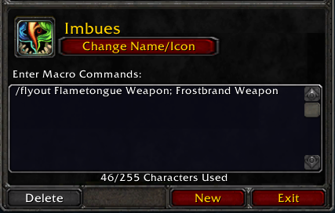

**Flyout** 是一款模仿后续资料片中所实现的弹出式技能栏功能的魔兽世界经典旧世（1.12版本）插件。

### 使用方法
1. 打开宏界面，创建一个新宏。
2. 在宏命令中，首先输入 `/flyout`，然后由分号拼接：法术名、普通宏名、物品名、装备名、超级宏名。
   - 限定法术等级，请使用 `寒冰箭（等级 1）`。要使用当前可用的最高等级，直接使用 `寒冰箭`。
   - 保持弹出栏（*点击弹出项后*）打开状态，直到鼠标移开，可使用 'sticky' 宏条件（例如：`/flyout [sticky] 分解; 附魔`）。
   - 默认动作图标（*仅限宏图标*）为首个动作图标，可使用 'icon' 宏条件（例如：`/flyout [icon] 分解; 附魔`）。

   

3. 将新创建宏拖至动作条上，即可使用。

   

点击动作栏图标或按下绑定按键会执行列表中的首个动作，右键点击弹出栏中任意动作会将其设置为默认动作。  
你可以在游戏内聊天框中输入 `/flyout` 来查看可用的自定义选项列表。

### 兼容性
兼容的插件：
- ElvUI
- pfUI
- Bartender2
- Bongos
- Roid-Macros
- CleverMacro
- MacroExtender
- SuperMacro

### 扩展功能
- 已实现
   - 支持物品
   - 支持装备
   - 支持超级宏
   - 优化默认动作执行兼容性（因`SuperMacro`插件钩子`UseAction`函数未回调原函数）
- 待实现
   - 支持物品数量总计、施法高亮
   - 支持装备施法高亮
   - 隐藏装备比对信息
